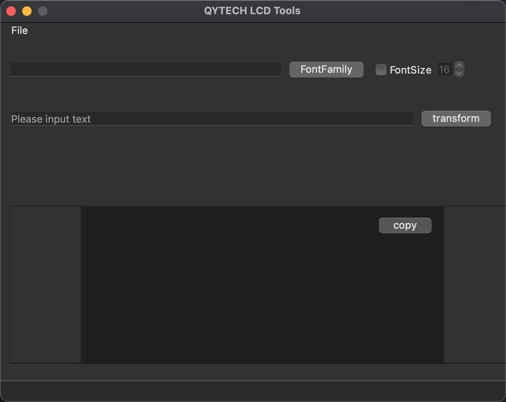
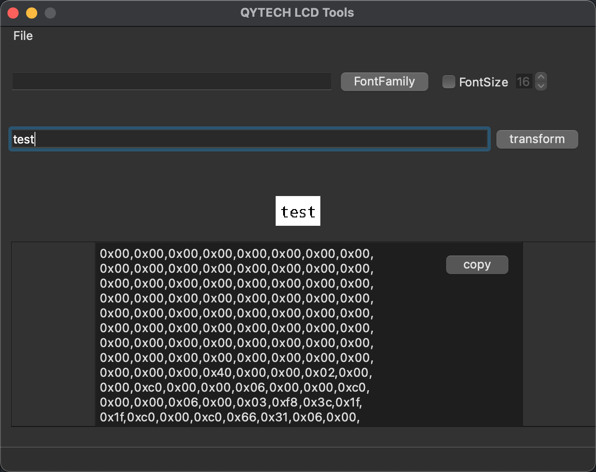
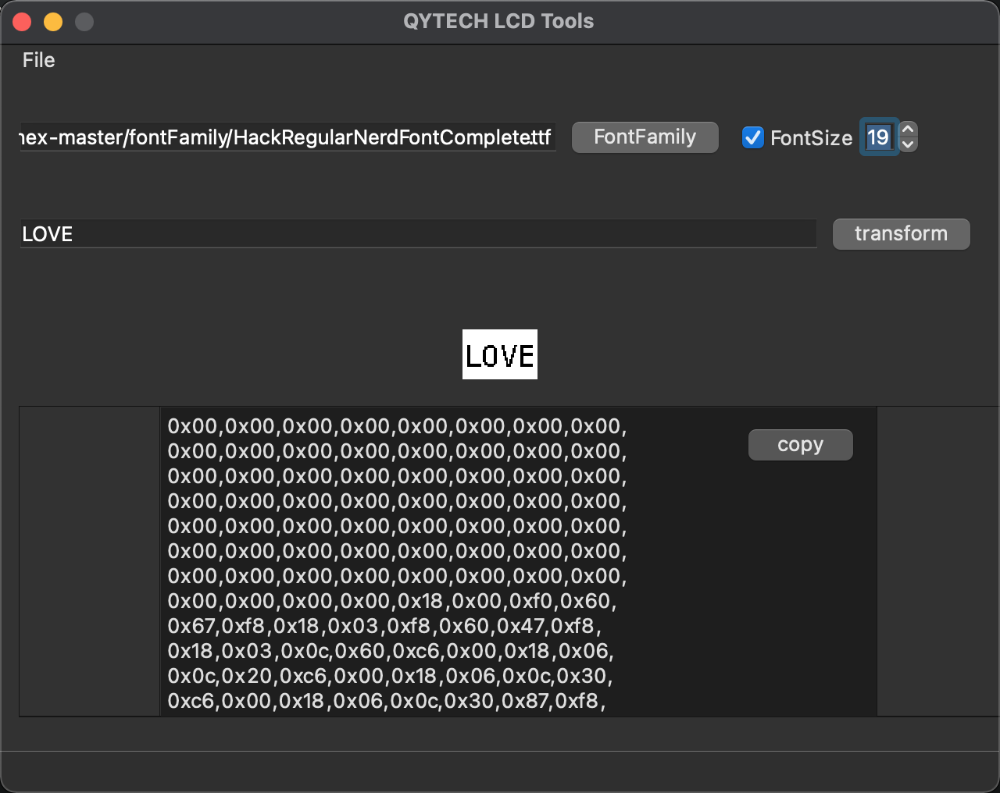
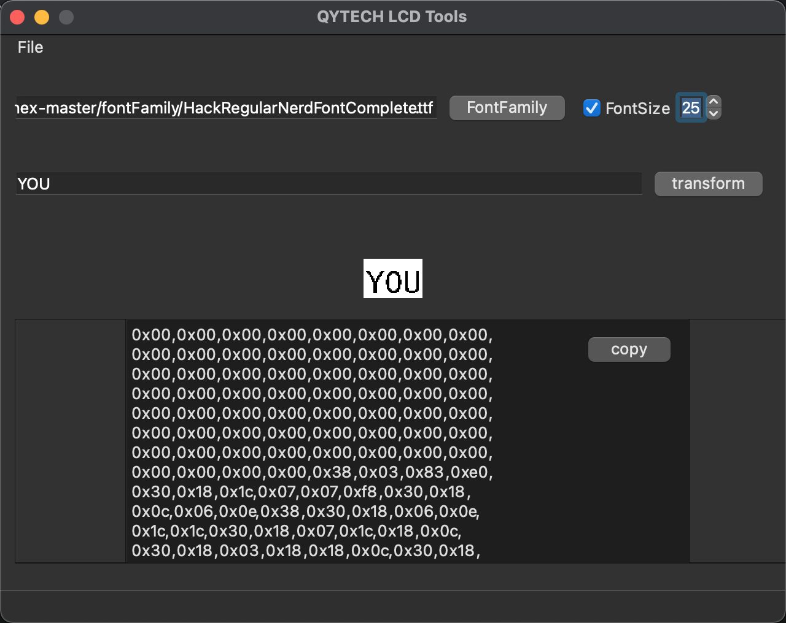
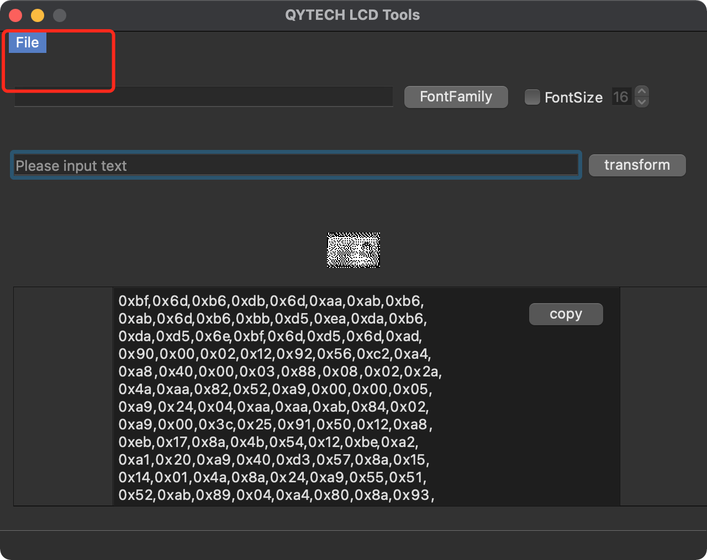
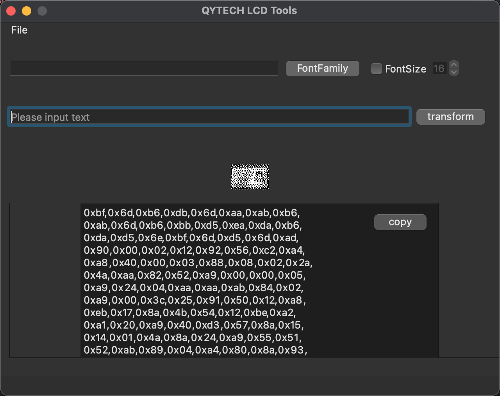

# LCDTools

LCDTools is a tool for text and image to lcd bitmap array .

## Text to LCD

Default Input text and click transform you can preview result and get lcd bitmap array .

If you want to specify the size or font of the text you can do the following

## Image to LCD

You can also convert mainstream photos to corresponding LCD

